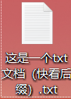
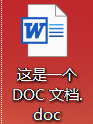
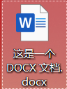
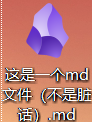
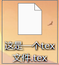

# 文本编辑

> - 文本文件的种类
> - 文本文件的规范化
> - 文本编辑器的选用
> - 文本编辑的版本控制
> - 文本编辑器的插件和扩展

## 让我们先来点大家熟悉的知识

我们通常见到的文本文件就像这样

- txt 文件
  
- dox 文件
  
- docx 文件
  

还有其他类型的文本文件
例如

- markdown 文件
  

- tex 文件
  

## 文本文件的定义

> 文本文件是一种计算机文件类型，其中包含了以文本形式表示的字符数据。文本文件中的内容是由字符组成的，可以是字母、数字、标点符号和其他可打印字符。文本文件通常使用 ASCII、UTF-8 或其他编码方式来表示字符。

与文本文件相对应的是二进制文件，二进制文件包含的是以二进制形式表示的数据，可以包含任意类型的数据，如图像、音频、视频等。

常见的文本文件扩展名包括`.txt`、`.csv`、`.xml`、`.json`等，不同的扩展名通常表示了文件的用途和格式。文本文件在各种计算领域和应用中广泛使用，如编程源代码文件、配置文件、日志文件、数据文件等。

## 文本文件的特点

### 可读性

由于文本文件以字符形式存储数据，因此可以**_直接打开_**并查看其内容。文本文件可以使用文本编辑器或其他文本处理工具进行查看和编辑。

### 字符编码

文本文件使用特定的字符编码来表示字符。常见的编码方式包括 `ASCII`、`UTF-8`、`UTF-16` 等，不同的编码方式支持不同的字符集和语言。
[编码的介绍](#相关链接)

### 逐行读取

文本文件通常按行组织数据，每行表示一个逻辑单元，如一段文字、一条记录等。在处理文本文件时，常常按行读取和处理数据。

### 可移植性

由于文本文件使用标准字符编码方式表示数据，因此在不同的计算机系统和操作系统之间具有良好的可移植性。文本文件可以在不同系统上进行共享和交换，而无需担心字符编码的兼容性问题。

## 文本文件的类别

> 纯文本文件
> 文档文件
> 标记语言文件
> 配置文件
> 数据文件
> 脚本文件

配置文件：配置文件用于存储应用程序或系统的配置信息。它们通常以纯文本形式存储，包含键值对或其他结构化格式，以指定各种设置选项。常见的配置文件包括 INI 文件、JSON 文件、YAML 文件等。

数据文件：数据文件包含结构化或半结构化的数据，以文本形式存储。它们可以是 CSV 文件（逗号分隔值）、TSV 文件（制表符分隔值）、JSON 文件、XML 文件等，用于存储和交换数据。

脚本文件：脚本文件是包含一系列可执行命令的文本文件。它们用于自动化任务、批处理、编程等。常见的脚本文件包括 Shell 脚本、Python 脚本、JavaScript 脚本等。

文档文件：文档文件包括各种文本文档，如报告、论文、备忘录等。它们通常以特定的格式（如 Microsoft Word、PDF、LaTeX 等）存储，并包含文本、图像、表格、图表等元素。

> 以下是纯文本文件

### 纯文本文件（Plain Text）

纯文本文件（Plain Text File）是一种以纯文本形式存储的文件，其中只包含文本字符，没有任何格式、样式、图像或其他非文本数据。纯文本文件使用简单的字符编码（如 ASCII、UTF-8 等）来表示文本内容。

> 以下是文档文件

文档文件通常以特定的格式（如 Microsoft Word、PDF、LaTeX 等）存储，并包含文本、图像、表格、图表等元素。

### Tex 文件

TeX 文件使用纯文本形式存储，可以使用任何文本编辑器来创建和编辑。文件内容包括文本、命令、环境和注释等元素，它们共同定义了文档的结构和样式。

> 以下是标记语言文件

标记语言文件：标记语言文件使用标记语言（如 HTML、XML、Markdown 等）编写，用于描述文档的结构、内容和样式。它们使用特定的标记和标签来定义元素和属性，并可以包含纯文本内容。常见的扩展名包括".html"、".xml"、".md"等。

### html 文件

HTML 文件是一种标记语言文件，用于创建网页和网页内容。HTML（Hypertext Markup Language）使用标签和元素来描述文档的结构和内容，并定义了网页的外观和行为。

HTML 文件通常以".html"或".htm"为扩展名，可以使用任何文本编辑器创建和编辑。HTML 文件由一系列标签和文本组成，这些标签用于表示不同的元素和属性，并通过嵌套和属性设置来构建网页的结构和样式。

HTML 文件的基本结构如下：

```html
<!DOCTYPE html>
<html>
  <head>
    <title>页面标题</title>
  </head>
  <body>
    <h1>这是一个标题</h1>
    <p>这是一个段落。</p>
  </body>
</html>
```

在上面的示例中，`<!DOCTYPE html>`声明了文档类型为 HTML5。`<html>`标签定义了整个 HTML 文档的根元素。`<head>`标签包含了文档的元数据，如标题(`<title>`)、样式表、脚本等。`<body>`标签包含了网页的主要内容，如标题(`<h1>`)和段落(`<p>`)。

HTML 文件中的标签和元素可以根据需要进行嵌套和组合，以创建不同的网页结构和效果。通过使用各种标签和属性，可以插入图像、链接、表格、列表、表单、多媒体等丰富的内容和交互元素。

HTML 文件可以通过浏览器进行渲染和显示，以呈现出格式化的网页。浏览器会解析 HTML 文件，并根据标签和属性的指示来显示文本、图像、链接和其他元素，从而实现网页的可视化效果。

总之，HTML 文件是用于创建网页和网页内容的标记语言文件。它使用标签和元素来描述文档的结构和内容，并通过浏览器渲染和显示，以展示出美观和交互的网页。

### **_Markdown 文件_**

Markdown 是一种轻量级标记语言。 它允许人们使用易读易写的纯文本格式编写文档，然后转换成有效的 HTML 文档。

由于 Markdown 的轻量化、易读易写特性，并且对于图片，图表、数学式都有支持，许多网站都广泛使用 Markdown 来撰写帮助文档或是用于论坛上发表消息。 如 GitHub、Reddit、Diaspora、Stack Exchange、OpenStreetMap 、SourceForge、简书等，甚至还能被使用来撰写电子书。

[markdown 详解](https://markdown.com.cn/cheat-sheet.html#%E6%80%BB%E8%A7%88)

> 以下是配置文件&数据文件

### XML 文件（Extensible Markup Language）

XML 是一种用于描述数据的标记语言，具有自定义的标签和结构。XML 文件使用纯文本格式存储，并通过标签和属性来组织和表示数据。

### JSON 文件（JavaScript Object Notation）

JSON 是一种轻量级的数据交换格式，常用于将数据结构化和传输。JSON 文件使用纯文本格式，以键值对的形式表示数据。

> 以下是脚本文件

脚本文件是包含一系列可执行命令的文本文件。它们用于自动化任务、批处理、编程等。常见的脚本文件包括 Shell 脚本、Python 脚本、JavaScript 脚本等。

### python 脚本

```python

print("Hello World")
```

### bat 脚本

**_这是一个关机脚本:_**
[click here ,it may surprise you](shutdown.bat)

## 版本控制

> 文件的版本控制是一种管理文件变更的系统，用于跟踪、记录和控制文件在不同时间点的修改和演变。它允许用户保存文件的历史版本，并提供了以下功能：

### 版本历史记录

版本控制系统（VCS）可以记录每次文件的修改，包括修改的内容、时间戳、作者等信息。通过版本历史记录，用户可以查看和比较不同版本之间的差异。

### 并行开发

版本控制系统允许多个人或团队成员同时对同一个文件进行修改，并能够合并（merge）不同的修改。这样，多个人可以并行开发，避免文件冲突和数据丢失。

### 回滚和恢复

如果文件的某个版本出现问题或需要回退到之前的状态，版本控制系统可以轻松进行回滚操作，将文件恢复到以前的版本。

### 分支管理

版本控制系统可以创建分支（branch），允许用户在不同的开发线路上独立工作。分支可以用于开发新功能、修复问题或尝试实验性的修改，而不会影响主线（master）版本。

### 协作和协议

版本控制系统提供了协作和协议机制，让团队成员能够共享和协同工作。它可以跟踪每个人的贡献，保留修改的作者信息，并提供讨论和评论的功能。

常见的版本控制系统包括 Git、Subversion（SVN）、Mercurial 等。这些系统可以用于管理各种类型的文件，包括代码文件、文档、配置文件等。它们提供了命令行界面和图形用户界面（GUI），以便用户进行版本控制操作和管理。

版本控制系统不仅适用于团队协作和软件开发，也可用于个人项目、文档管理、写作等场景。它们提供了可靠的历史追踪和备份功能，确保文件的完整性和可追溯性，同时提供了灵活性和效率，使文件管理更加方便和可控。

### **_git_**

[git](#相关链接)

## 文本编辑器

文本编辑器是用于创建、编辑和处理纯文本文件的软件工具。它们提供了基本的文本编辑功能，如插入、删除、复制、粘贴、查找和替换等操作，以及一些额外的功能来提高编辑效率和便利性。

以下是一些常见的文本编辑器：

### 记事本（Notepad）

记事本是 Windows 操作系统自带的简单文本编辑器，功能简单，适合进行基本的文本编辑操作。

### Microsoft Office Word

Microsoft Office Word（简称 Word）是由 Microsoft 开发的一款流行的文字处理软件。它是 Microsoft Office 套件的一部分，提供了丰富的功能和工具，用于创建、编辑和格式化文档。

### Visual Studio Code

Visual Studio Code（简称 VS Code）是一款免费开源的跨平台文本编辑器，由微软开发。它支持丰富的插件生态系统，提供了强大的代码编辑、调试和版本控制等功能，广泛用于软件开发。

### Sublime Text

Sublime Text 是一款流行的跨平台文本编辑器，提供了丰富的功能和插件生态系统。它支持多重选择、语法高亮、自动完成、宏命令等功能，可适用于各种编程和文本处理任务。

### Emacs

Emacs 是另一款高度可定制的文本编辑器，也是一个完整的操作环境。它提供了强大的编辑功能和大量的扩展，可用于文本编辑、编程、电子邮件等多种任务。

### Vim

Vim 是一款高度可定制的文本编辑器，适用于各种操作系统。它提供了强大的编辑和扩展功能，可以通过命令行或图形界面进行操作。

除了上述编辑器，还有其他许多文本编辑器可供选择，如 Atom、Notepad++、UltraEdit 等。每个编辑器都有其特定的特点和适用场景，可以根据个人需求和偏好选择合适的编辑器。

常见的文本编辑器包括微软的 Word、谷歌的 Docs、苹果的 Pages 等用于办公文档的编辑器，以及专门用于编程的编辑器，如 Visual Studio Code、Sublime Text、Atom 等

### 个人推荐的笔记软件

> obsidian
> Typora

## 相关链接

链接顺序按照文中顺序

### [关于编码的简单简介](/Text%20editor/encode.md)

### [json 看看这里](https://zhuanlan.zhihu.com/p/644753810)

### [版本控制介绍](https://blog.csdn.net/Roaddd/article/details/119800942)

### [git 入门](https://blog.csdn.net/qq_35206244/article/details/97698815)

### [sublime text3 入门教程](https://blog.csdn.net/sam976/article/details/75333079)

### [vim 讲解](https://www.runoob.com/linux/linux-vim.html)

### [Emacs 入门讲解](https://zhuanlan.zhihu.com/p/385214753)

### [latex 入门讲解](https://zhuanlan.zhihu.com/p/353883701)
